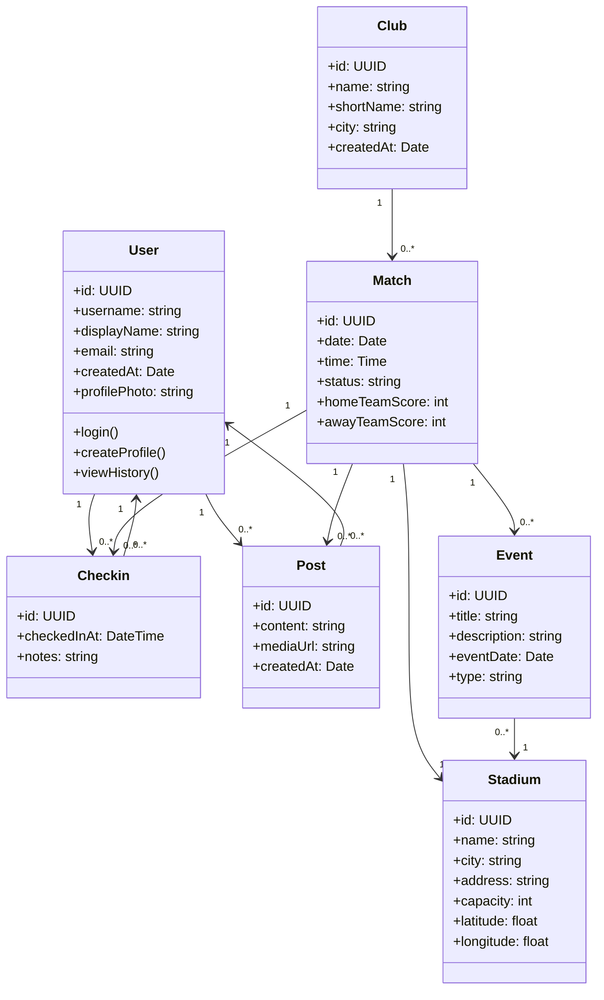

# 1. Domenemodell for Stadionhopper

## 1.1 Innledning

Domenemodellen beskriver de viktigste konseptene i Stadionhopper og relasjonene mellom dem. Målet er å modellere det problemfeltet som systemet skal støtte, ikke bare den tekniske løsningen. Vi skal derfor beskrive hvilke konsept som er sentrale i brukerreisen og i verdiskapningen for systemet.

For Stadionhopper er det viktig å skille mellom:

- konsept som er kjernen i produktet (kamp, stadion, bruker, innsjekking)
- konsept som er viktige for videreutvikling (arrangement, innlegg, klubb, interaksjoner)
- konsept som er tekniske nødvendigheter (autentisering, profil, historikk)

Domenemodellen skal være enkel nok til å kunne brukes som grunnlag for utvikling, samtidig som den er rik nok til å støtte videre iterasjon og nye funksjoner.

## 1.2 Sentrale konsept

### Bruker
En bruker er en person som har en profil i systemet. Brukeren kan logge inn, opprette profil, få tilgang til sin historikk og registrere kampbesøk. Brukeren er den sentrale aktøren i produktet og knytter sammen personalisert brukerhistorikk med kamp- og stadionopplevelser.

### Stadion
Et stadion er den arenaen hvor en kamp spilles. Stadionet har informasjon om navn, plassering og mulig relevante detaljert om fasiliteter. Stadionet er viktig fordi brukerens opplevelse er bundet til den konkrete arenaen, og fordi stadionbruk blir en merverdi som skiller Stadionhopper fra en enkel kampoversikt.

### Klubb
En klubb er et lag eller en lokal fotballforening som deltar i et arrangement eller en kamp. Klubber er viktige som organisasjonsenhet, både for oppslag av kamper og for videre utvikling av profiler, arrangementer og kampinformasjon.

### Kamp
En kamp er en konkret utestående fotballkamp mellom to klubber. En kamp har dato, tidspunkt, stadion og status. Den er den mest sentrale enheten i systemet fordi den knytter sammen både brukerinteresse, geografisk oppdagelse og historikk.

### Innsjekking
En innsjekking representerer at en bruker har registrert at de deltok på en kamp. Innsjekkingen er en viktig historikk- og motivasjonsmekanisme. Den kobler sammen bruker og kamp, og fremtidig kan den brukes til statistikk, belønning, sosial interaksjon og opplevelsesdokumentasjon.

### Innlegg
Et innlegg er en bruker-generert publisering knyttet til en kamp, et stadion eller en opplevelse. Det kan være tekst, bilde eller kommentar. Innlegg er viktig for social value, men er ikke nødvendig i første nivå av MVP. Derfor skal det være modellert som eget konsept, men ikke nødvendigvis som førsteutgave i den minst komplekse implementasjonen.

### Arrangement
Et arrangement er en kategorisering eller et hendelsesforløp som knyttes til en kamp, klubbsituasjon eller felles opplevelse. Arrangement kan brukes til eksempelvis “lagkamp”, “sponsorarrangement”, “familiedag”, eller en sosial samling rundt en kamp. Det er et viktig konsept for å kunne støtte videreutvikling uten å presse den første versjonen med for mye kompleksitet.

## 1.3 Relasjoner mellom konseptene

Relasjonen mellom konseptene kan oppsummeres som følger:

- En bruker kan gjøre flere innsjekkinger.
- En innsjekking tilhører én bruker og én kamp.
- En kamp spilles på ett stadion.
- Et stadion kan ha mange kamper.
- En kamp involverer to klubber.
- En klubb kan spille mange kamper.
- En bruker kan publisere flere innlegg.
- Et innlegg kan være knyttet til en kamp, en klubb eller et stadion.
- Et arrangement kan knyttes til en kamp eller et stadion, og kan være publisert i feeden.

For å sikre at modellen har verdi som grunnlag for utvikling, er det viktig at relasjonene er tydelige og ikke for komplekse. Vi modellerer derfor hovedrelasjonene først, og lar mer avanserte konsept som innlegg og arrangement være utvidelser som kan bygges inn senere.

## 1.4 UML-modell

## 1.5 Begrunnelse for modellvalget

Vi har valgt en relativt enkel domenemodell som er lett å forstå, men som samtidig dekker kjerneverdien i Stadionhopper. Denne modellen gjør det mulig å:

- finne kamper
- koble dem til stadionet
- registrere besøket
- få en personlig historikk
- utvide systemet med sosialt innhold og arrangementer senere

Det som er viktig er at modellen ikke blir så kompleks at den virker som en “teknisk løsning” i stedet for et faktisk domene. Vi ønsker en modell som kan brukes både i teknisk design og i samtaler med interessenter.

## 1.6 Hva som er MVP og hva som er fremtidig utvidelse

I første iterasjon prioriteres følgende:

- bruker
- kamp
- stadion
- klubb
- innsjekking

Det vil si at disse er grunnlag for den første utviklingen. Delene som er mer sosialt orienterte:

- innlegg
- arrangement
- sosial feed

er modellert som relevante konsept, men deres konkrete funksjonalitet kommer senere. Dette er viktig fordi oppgaven krever at teamet demonstrerer forståelse for hvordan systemet kan bygges videre, samtidig som vi ikke overloader MVP-en med uforholdsmessig mye kompleksitet.

## 1.7 Oppsummering

Domenemodellen viser at Stadionhopper er mer enn en kampoversikt. Det er et system som kobler sammen:

- informasjon om kamper
- plassering og tilknytning til stadion
- brukeropplevelser
- personlig historikk
- sosial og organisatorisk verdi

Dette er i tråd med produktvisjonen: Stadionhopper skal gjøre lokalfotball mer tilgjengelig, mer sosial og mer engasjerende.

