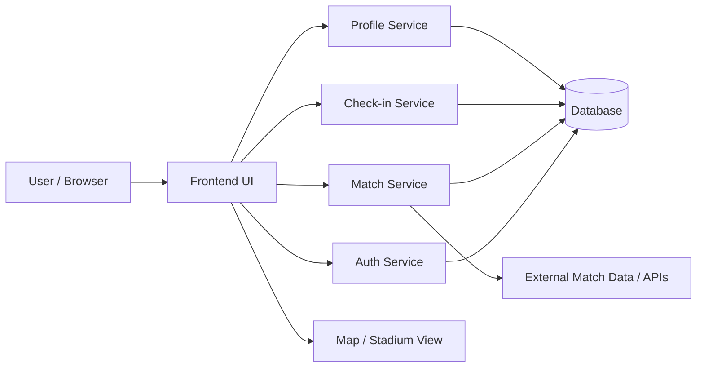

# 2. Arkitektur for Stadionhopper

## 2.1 Innledning

For å støtte produktvise og det tekniske grunnlaget for videre utvikling, må Stadionhopper ha en enkel, modulær og testbar arkitektur. Vi trenger et system som kan håndtere brukerinformasjon, kampdata, stadiondata og brukeres registrerte opplevelser, uten at løsningen blir så kompleks at den er vanskelig å utvikle, teste og vedlikeholde.

Det er viktig at arkitekturen er valgt på bakgrunn av produktmål, ikke omvendt. Stadionhopper skal gjøre det enklere å finne kamper, oppdage stadioner, gjennomføre innsjekkinger og bygge opp historikk. Dermed må arkitekturen støtte disse brukerreisene effektivt.

## 2.2 Arkitekturstilvalg

Vi anbefaler en lagdelt webarkitektur med følgende hovedlag:

1. Presentasjonslag (frontend)
2. Applikasjonslag (business logic / use cases)
3. Domene-/modell-lag
4. Persistens-/datalag
5. Eksterne integrasjoner

Denne valget er valgt fordi det er:

- enkelt å forstå
- lett å teste
- godt egnet for små og mellomstore prosjekt
- mulig å utvide senere uten at hele systemet må redesignes

Alternativer som var vurdert:

- monolitt løsning uten tydelig lagdeling: for enkel i starten, men vanskelig å skalere og vedlikeholde
- mikroservices med mange små tjenester: for kompleks i forhold til prosjektets størrelse og tidsramme
- ren frontend-løsning uten backend: mulig for prototype, men utilstrekkelig for autentisering, brukerhistorikk og systemforståelse

Vi velger derfor en balansert løsning hvor frontend og backend er tydelig separert, men hvor den totale kompleksitet beholdes lav.

## 2.3 Hovedkomponenter

### Frontend
Frontend er det bruker opplever. Her skal brukeren kunne:

- logge inn
- se kommende kamper
- filtrere på tidspunkt, stadion eller klubb
- få oversikt over stadioner på kart
- registrere innsjekking
- se profil og historikk
- oppdage relevante arrangement eller innlegg senere

Frontend skal være bygget som en enkel SPA (Single Page Application) eller en modulær webapplikasjon med klare komponenter.

### Auth & brukeradministrasjon
Denne komponenten håndterer:

- innlogging
- opprettelse av profil
- autorisering
- lagring av brukerdata

Dette er et kritisk komponent fordi innsjekkinger må knyttes til riktig bruker, og historikken må være personlig og sikker.

### Match/Domain service
Denne komponenten håndterer logikken rundt:

- kampoversikt
- stadiontilknytning
- kampstatus
- dagens, kommende og tidligere kamper

Dette er kjernen i systemet, fordi felten er i stor grad drevet av brukernes behov for reell oppdagelse av kamper.

### Check-in service
Dette er et funksjonelt sentralt komponent. Her håndteres:

- registrering av innsjekking
- kontroll mot duplikater
- oppdatering av historikk
- kobling til kamp og stadion

### Persistence layer
Lagres data i en databaseløsning som støtter:

- relasjoner mellom brukere, kamper og stadioner
- autentisering
- historikk over innsjekkinger
- senere utvidelser for innlegg og arrangement

Dette kan være en enkel SQL-database eller NoSQL-løsning, avhengig av valgt teknologi. For et prosjekt i denne størrelsen er en tydelig strukturerte database veldig viktig.

## 2.4 Dataflyt

Dataflyten i Stadionhopper kan beskrives som følger:

1. Brukeren åpner appen og ønsker å finne kommende kamper.
2. Frontend sender en forespørsel til Match Service.
3. Match Service henter relevant kampdata fra databasen.
4. Frontend viser kampinformasjon, lag, stadion og tidspunkt.
5. Brukeren åpner en kamp og velger “Registrer innsjekking”.
6. Check-in Service validerer brukeren og lagrer innsjekkingen mot den relevante kampen.
7. Historikken oppdateres på brukerprofilen.
8. Eventuelle sosialt interaktive funksjoner kan senere hente innlegg eller arrangementer relatert til samme kamp.

Dette er en enkel, men tydelig dataflyt som støtter produktets hovedmål: oppdage, oppleve og lagre opplevelsen.

## 2.5 Arkitekturdiagram

## 2.6 Ansvarsfordeling

Det er viktig at teamet har tydelige ansvar, både for utvikling og for beslutningstaking. Et eksempel på tydelig ansvarsfordeling er:

- Frontend ansvar: brukergrensesnitt, layout, navigasjon, responsivt design
- Backend / Services ansvar: domenelogikk, autentisering, kampdata, innsjekking
- Data ansvar: Datamodell, strukturell integritet, query-design
- UX ansvar: prototyping, brukerflyt, test av forståelighet
- Testing ansvar: kvalitetssikring, automatiske tester, dokumentasjon av testresultater

Dette figurerer godt i et team med tre medlemmer, fordi ansvarene kan overlappe og flyttes, men det er fortsatt viktig at noen har hovedansvar for hver del. Det styrker kvalitet, samarbeidsflyt og forståelse for hvordan systemet skal utvikles.

## 2.7 Tekniske beslutninger og begrunnelse

### Beslutning 1: Lagdelt arkitektur
Vi velger lagdelt arkitektur fordi det er enkel å kommunisere og gjennomføre i en eksamens- og prosjektkontekst. Det gjør at teamet lettere kan dele opp arbeidet og holde komponentene mest mulig uavhengige.

### Beslutning 2: Frontend og backend er separert
En tydelig adskillelse gjør det enklere å:

- teste frontend og backend separat
- gjenbruke modell og domenelogikk
- utvide med flere komponenter senere

### Beslutning 3: Ikke bygg hele systemet som mikroservices i første iterasjon
Dette ville økt kompleksitet uten at det gav ytterligere verdi i tidlig fasen. Produktet er i en startsfase og må først vise verdi i hovedflyten: finne kamp → registrere besøkt kamp → se historikk.

### Beslutning 4: Ryddig datamodell før omfattende sosial funksjonalitet
Domenet, relasjonene og dataflyten kommer først. Sosiale funksjoner bør bygges etter at grunnlaget er på plass, fordi de er avhengige av autentisering, historikk og konseptuell klarhet.

## 2.8 Hva er vurdert og hva er utelatt

Vi har vurdert følgende alternativer:

- full monolitt app for å redusere teknisk kompleksitet
- nettbasert frontend med localStorage for demo-prototyper
- mer kompleks backend-API med flere mikro-tjenester

I denne oppgaven er den beste balansen en tydelig, men ikke overteknisk arkitektur. Formålet er å vise forståelse, ikke å bygge den mest avanserte løsningen mulig.

## 2.9 Oppsummering

Arkitekturen skal støtte produktets hovedmål: å gjøre det enkelt å oppdage lokale footballkamper, samordne informasjon om stadioner, og gjøre opplevelser dokumenterbare for den enkelte bruker. Derfor vil løsningen være:

- enkel i oppbygning
- modulær i struktur
- testbar i utforming
- utvidbar for kommende funksjonaliteter

Dette er en god arkitektur for både eksamen og for videre utvikling av Stadionhopper.
